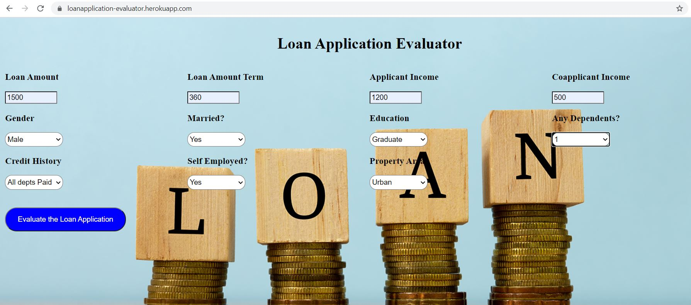

# Soc-2k22 Loan Application Evaluator, using ML approach, Flask and Heroku.

## Content
A loan application is used by borrowers to apply for a loan. Through the loan application, borrowers reveal key details about their finances to the lender. The loan application is crucial to determining whether the lender will grant the request for funds or credit.

## Problem Statement
Bank identified that going through the loan applications to filter the people who can be granted loans or need to be rejected is a tedious and time-consuming process. If this process can be automated, this will increase bank’s efficiency as well as transparency and a better decision.

## Objective
The idea behind this ML project is to build an ML model and web application that the bank can use to classify if a user can be granted a loan or not.

## Data
You can get the dataset from kaggle over [here](https://www.kaggle.com/datasets/altruistdelhite04/loan-prediction-problem-dataset)

## Week 1 and Week 2

During the week-1 I have revised the python basics, then I started
learning python libraries such as Numpy, Pandas, Matplotlib and Seaborn and get familiar with them. I have used the following resources provided 
1. [Python](https://youtube.com/playlist?list=PLsyeobzWxl7poL9JTVyndKe62ieoN-MZ3)
2. [Numpy](https://youtu.be/93uKo-F9SSo)
3. [Pandas](https://youtu.be/V620hYtbD6s)
4. [Matplotlib](https://youtu.be/rLVNEzPf8fU)

## Week 3 

During this week I have learnt the mathematics required for Machine Learning, Probability basics and started learning Machine Learning from Andrew NG course online and tried to implement some algorithms. These are some of the resources which helped me. Mainly this week I have focused on only two Machine Learning Algorithms 
1. [Online](https://www.coursera.org/learn/machine-learning?utm_source=gg&utm_medium=sem&utm_campaign=94-BrandedSearch-IN&utm_content=B2C&campaignid=1776545273&adgroupid=69298819109&device=c&keyword=coursera%20machine%20learning%20course&matchtype=b&network=g&devicemodel=&adpostion=&creativeid=346568280203&hide_mobile_promo&gclid=Cj0KCQjw0JiXBhCFARIsAOSAKqDdKdD2v7MRYoAy8iB7kTpcwZTKvgUH1XBmPnjaDGTs5SoPojLdATEaAhnpEALw_wcB)
2. [Linear_Regression](https://www.youtube.com/watch?v=NUXdtN1W1FE)
3. [Logistic_Regression](https://www.youtube.com/watch?v=VCJdg7YBbAQ)

## Week 4 and Week 5
During this period I have studied all the remaining algorithms and used the following resources which are shown below and also implemented the algorithms 

1. [Clustering](https://www.youtube.com/watch?v=Xvwt7y2jf5E)
2. [KNN](https://www.youtube.com/watch?v=4HKqjENq9OU)
3. [SVM](https://www.youtube.com/watch?v=TtKF996oEl8)
4. [Decision_Trees](https://www.youtube.com/watch?v=RmajweUFKvM)
5. [Random_Forest](https://www.youtube.com/watch?v=eM4uJ6XGnSM)

## Week 6
During this week I have worked on the dataset explored the data and analysed the given data, dataset I have used can be found over [here](https://www.kaggle.com/datasets/altruistdelhite04/loan-prediction-problem-dataset), I have used the following resources 
1. [Data_Cleaning](https://www.kaggle.com/learn/data-cleaning)
2. [Data_handling](https://towardsdatascience.com/data-cleaning-in-python-the-ultimate-guide-2020-c63b88bf0a0d)
3. [Missing_Data](https://towardsdatascience.com/7-ways-to-handle-missing-values-in-machine-learning-1a6326adf79e)

## Week 7 and Week 8 

During these two weeks I have started working on the main model. I have used various ML algorithms and finally deployed the model in heroku using flask. Approach is written below 

## Approach
Following steps are performed:
1. Read the data and perform necessary cleaning and EDA. (Loan_Application.ipynb)
2. Training various models and tune it. (Loan_Application.ipynb)
3. Select best performing model and serialize it using pickle. (Loan_Application.ipynb)
4. Build an webapp using Flask framework. (app.py)
5. Host using Heroku, a Platform as a service.

## Outcome
Based on the data entered on the website and ML Model predicts the whether **Loan Application** is **Approved** or **Rejected**.

## Website

Below is the website hosted in Heroku.

[here](https://loanapplication-evaluator.herokuapp.com/)

  

